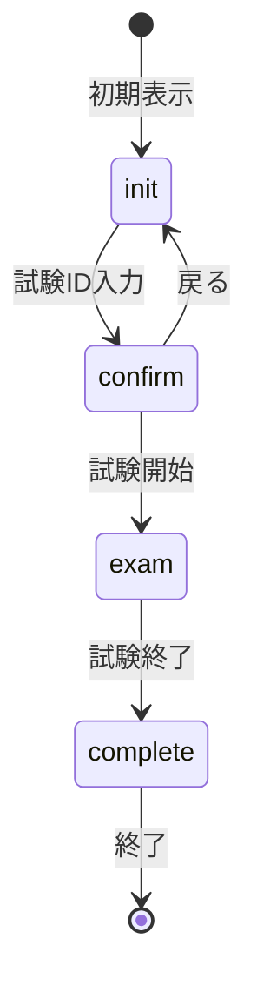

# 試験管理システム 詳細設計書

## 1. システム概要
試験の作成、受験、結果管理を行うWebアプリケーション。管理者は試験問題を作成・編集し、受験者はWebブラウザから試験を受験、結果を確認できる。

## 2. 機能詳細設計

### 2.1 試験受験機能

#### 2.1.1 状態遷移


#### 2.1.2 コンポーネント構成
- ExamApp: 試験受験機能のルートコンポーネント
  - ExamStartForm: 初期入力フォーム
  - ExamConfirmation: 試験開始前の確認
  - ExamContainer: 試験中のメインインターフェース
  - ResultsContainer: 結果表示

#### 2.1.3 主要なカスタムフック
- useExamState: 試験の状態管理
- useExamData: 試験データの取得
- useExamAnswers: 解答の管理
- useExamTimer: タイマー管理
- useExamGrading: 採点処理
- useExamFinish: 試験終了処理

#### 2.1.4 画面遷移詳細
1. 初期画面（init）
   - 試験IDの入力
   - 入力値のバリデーション
   - 試験データの取得開始

2. 確認画面（confirm）
   - 試験情報の表示（試験ID、問題数、制限時間）
   - 試験開始確認
   - 前画面への戻り機能

3. 試験画面（exam）
   - 問題表示
   - 解答入力
   - タイマー表示
   - ナビゲーション
   - 試験終了確認ダイアログ

4. 結果画面（complete）
   - 得点表示
   - 正誤表示
   - 詳細結果表示

### 2.2 データ設計

#### 2.2.1 試験データ構造
```typescript
interface ExamData {
  id: string;
  title: string;
  questions: Question[];
  timeLimit: number; // 制限時間（分）
}

interface Question {
  id: string;
  type: 'single' | 'multiple' | 'fill' | 'sort' | 'text';
  text: string;
  options?: string[]; // 選択肢（選択問題の場合）
  correctAnswer: string | string[]; // 正解
  explanation?: string; // 解説
}
```

#### 2.2.2 解答データ構造
```typescript
interface ExamAnswer {
  examId: string;
  startTime: string;
  endTime: string;
  answers: {
    [questionId: string]: string | string[];
  };
}
```

### 2.3 セキュリティ設計

#### 2.3.1 画面キャプチャ防止
- 専用ブラウザモードでの試験実施
  - Chromeのシンプルビューアモードを利用
  - 拡張機能や開発者ツールを無効化
  - 画面キャプチャ防止機能の有効化

#### 2.3.2 通信セキュリティ
- HTTPS通信の必須化

### 2.4 パフォーマンス設計

#### 2.4.1 タイマー処理
- 1秒間隔のタイマー更新
- バックグラウンドでの時間計測
- タイムアウト時の自動終了処理

## 3. 試験作成・編集機能設計

### 3.1 機能概要
- 試験問題の作成・編集
- 問題タイプの管理
- 正解設定
- 推奨正解設定
- 解説設定
- 制限時間設定

### 3.2 コンポーネント構成
- ExamEditorPage: 編集画面のルートコンポーネント
  - QuestionCard: 問題カード
  - ChoiceQuestionFields: 選択問題編集フォーム
  - FillInQuestionFields: 記述問題編集フォーム
  - SortQuestionFields: 並べ替え問題編集フォーム
  - TextQuestionFields: 論述問題編集フォーム

### 3.3 状態管理
- 問題リストの状態管理
- 編集中の問題の状態管理
- バリデーション状態
- 保存状態

### 3.4 データ設計
```typescript
interface ExamEditorData {
  id: string;
  title: string;
  description: string;
  questions: Question[];
  timeLimit: number;
  createdAt: string;
  updatedAt: string;
}
```

## 4. 試験結果管理機能設計

### 4.1 機能概要
- 試験結果の一覧表示
- 個別結果の詳細表示
- 結果のエクスポート
- 統計情報表示

### 4.2 コンポーネント構成
- ExamAdminPage: 管理画面のルートコンポーネント
  - ExamResultSummary: 結果サマリー
  - ExamAnswerDetails: 解答詳細
  - ExamResultUploader: 結果アップロード

### 4.3 データ設計
```typescript
interface ExamResult {
  examId: string;
  score: number;
  total: number;
  startTime: string;
  endTime: string;
  answers: {
    [questionId: string]: {
      answer: string | string[];
      correct: boolean;
    };
  };
}
```

## 5. エラーハンドリング設計

### 5.1 エラー種別
- ネットワークエラー
- データ取得エラー
- バリデーションエラー
- タイムアウトエラー
- システムエラー

### 5.2 エラー処理方針
- ユーザーへのエラーメッセージ表示
- エラーログ記録
- リトライ処理
- フォールバック処理

## 6. 監査証跡設計

### 6.1 記録対象
- 試験作成・編集履歴
- 試験受験履歴
- 結果閲覧履歴

## 7. バックアップ設計

### 7.1 バックアップストレージ
- オンプレミスストレージ
- クラウドストレージ（AWS S3）

## 8. テスト設計

### 8.1 単体テスト
- 各コンポーネントの表示テスト
- カスタムフックの動作テスト
- 状態遷移のテスト

### 8.2 結合テスト
- 画面遷移のテスト
- データ取得から結果表示までのフローテスト
- タイマー機能のテスト

### 8.3 パフォーマンステスト
- 大規模試験データ（100問）での動作確認
- 長時間試験（120分）での動作確認
